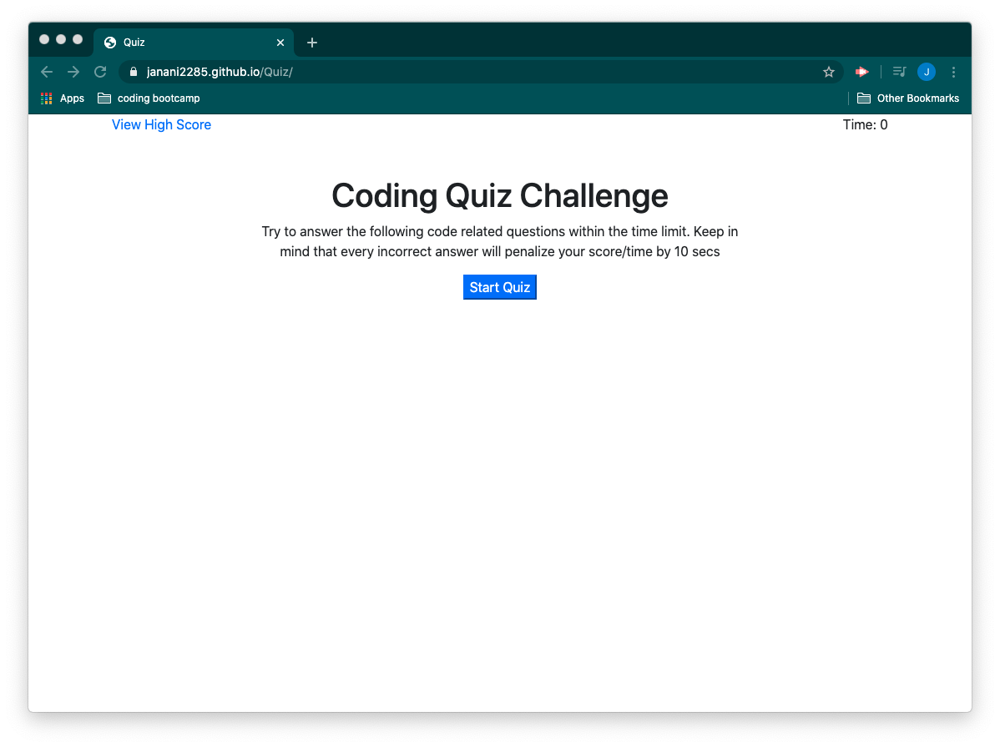
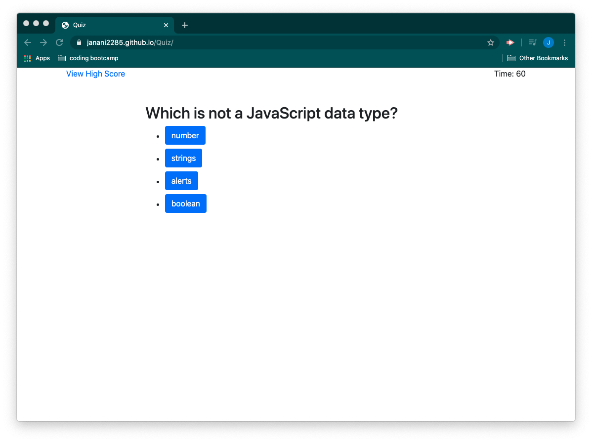
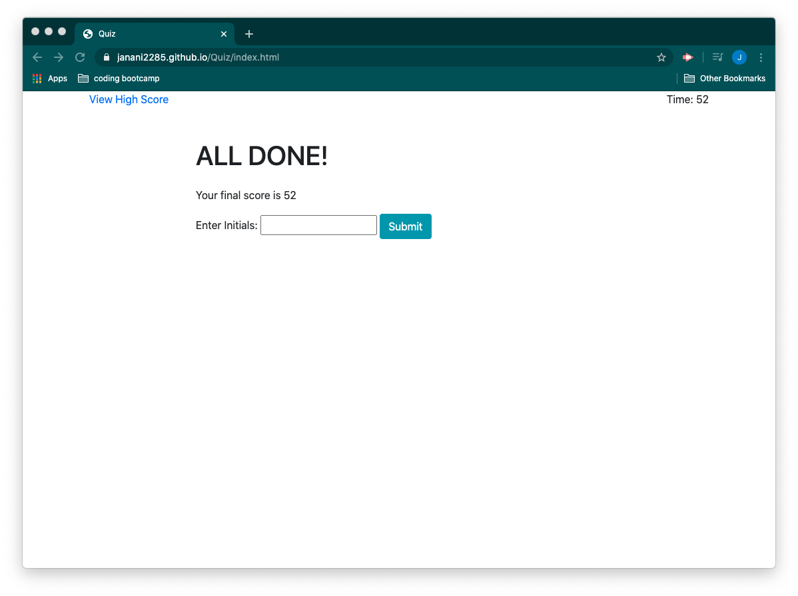
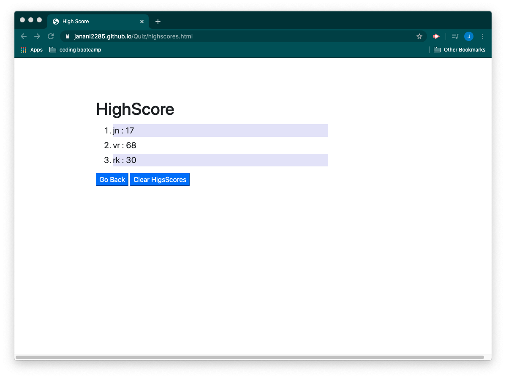

# Quiz

## Description 

This repository consists of code that runs a timed quiz. The project uses an HTML page for user interface, bootstrap for styling the HTML and to include responsive behavior to match all screen size. The application uses java script to implement the logic. 

When the user clicks on "Start Quiz" button in the main page, the application runs a countdown timer. The user is displayed with a series of technical questions. Whan the user selects th right answer, the application displays a message stating the answer is correct and proceeds to display the next question. If the user selects a wrong answer, the application displays a message stating the answer is incorrect, reduces the timer by 10 secs (the user loses 10secs in the quiz) and proceeds to display the next question.

If the user answers all the questions before the time runs out, his final score, which is the time remaining, is displayed and the user is asked to enter his initials. When the user clicks "Submit" button, he/she is taken to the high score page where all the high scores of users are displayed. In this page the user has an option to clear the high score or go back to main page.

If the user ran out of time. The application displays the final score of the user as 0 and asks the user to enter his initials.

There is a link on the main page to view all highscores. File handling is used inorder to store, read and write the high scores of users.

Git is used for version controling and for perioding commits to Gitlab.

## Deployed Application URL
 https://janani2285.github.io/Quiz/

## Screenshots of the application

